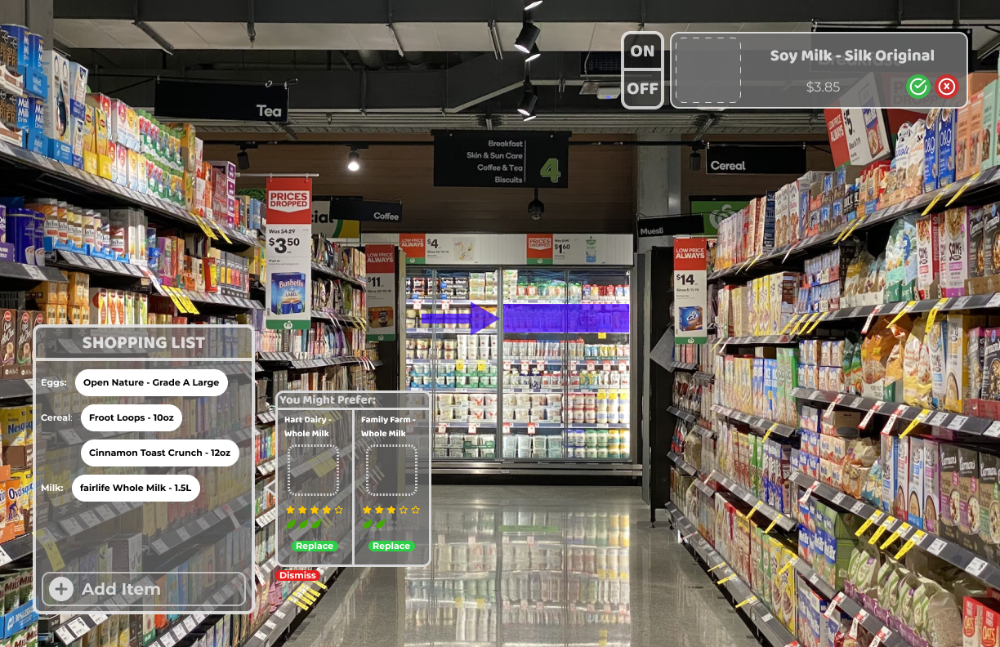
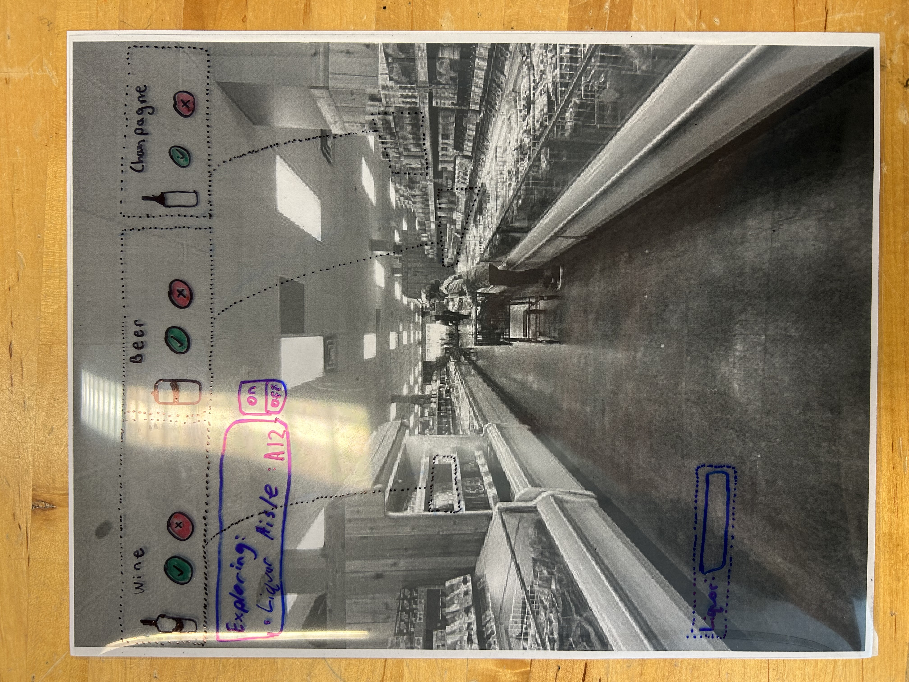
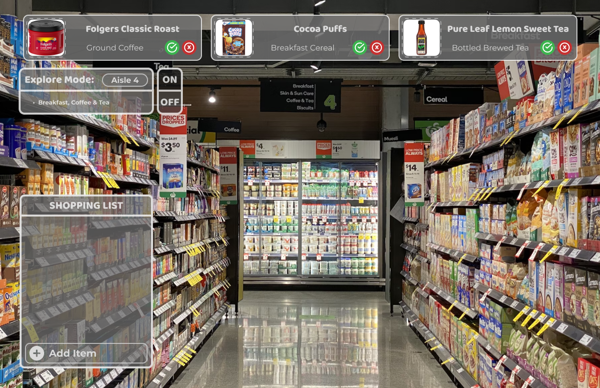
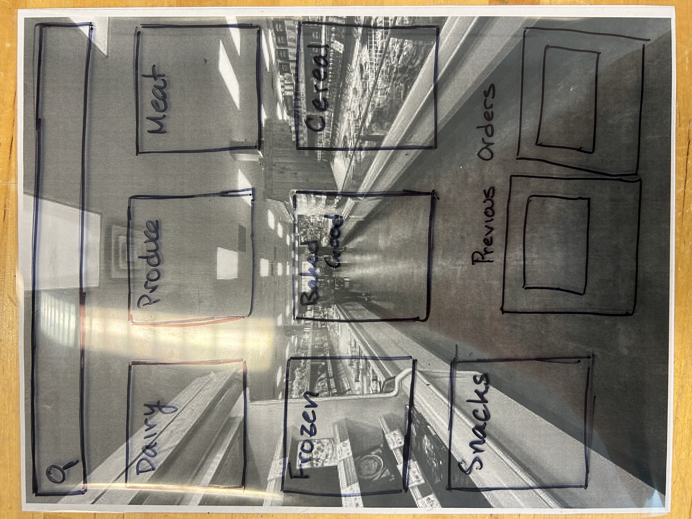
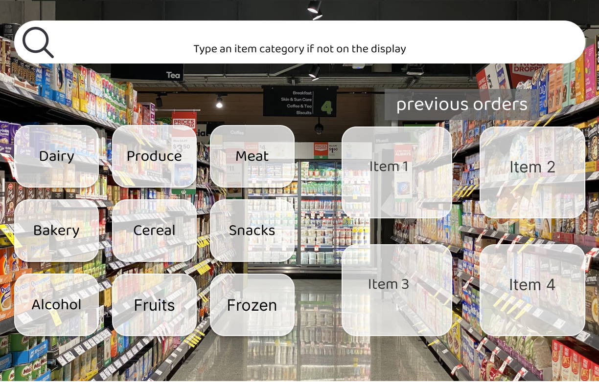
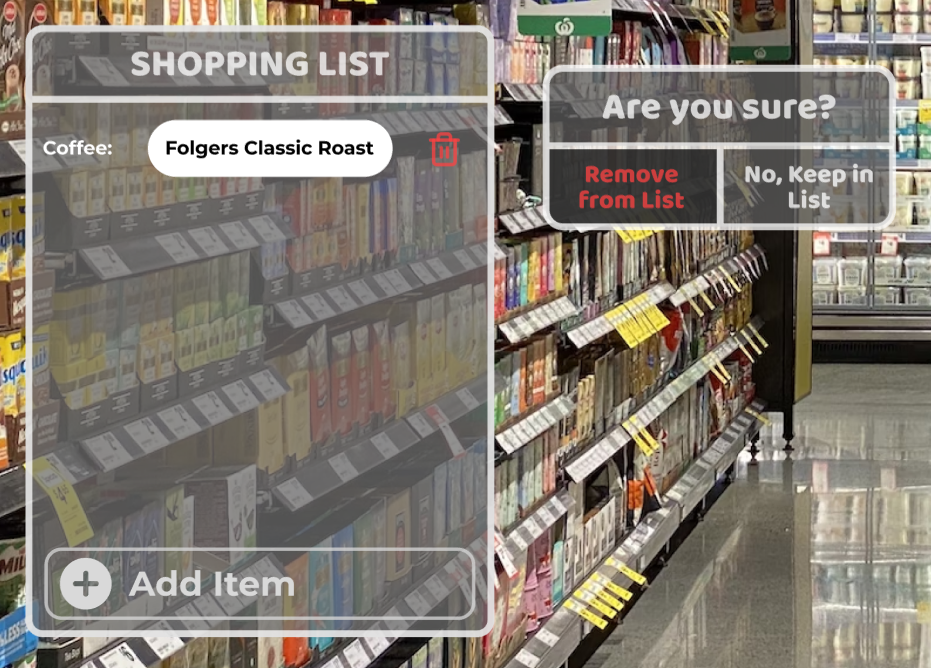

### What is your design?
This description is an overview of what is written in the [Design Development Submission](../design_development_phase/design_development.md), with some updates to reflect the wireframe prototype. If you want a walkthrough of the shopping experience, see our [Cognitive Walkthrough](cognitive_walkthrough.md).

The design that our team ended up choosing is an in-store shopping aide in the form of AR glasses. Our core problem statement is that it is currently very difficult for consumers to compare companies based on their carbon footprint or other ESG (environmental, social, governance) metrics. Our AR glasses solution empower users to utilize readily available statistics, without needing to spend hours of their own time parsing datatables online, to evaluate the items they are buying in real-time and to make optimal purchasing decisions for themselves.

As stated in our feature idea description, our solution needs to include an interface that can be quickly understood by the average consumer that allows them to identify the most sustainable product out of the options available to them in the store. This means that the information that our AR glasses present to the user needs to be streamlined, simple, and essential. 

Our interface is composed of three key shopping phases:
||Paper Prototype|Figma|
| ----------- | ----------- | ----------- |
|**Shopping List**, where the user has a set amount of items they wish to buy before entering the store.||  |
|**Explore**, where the user wishes to browse in the store before making purchasing decisions.|| |
|**Search**, where the user is looking for a certain product in the store.||  |

### How Does it Work?

Our AR product works in 4 steps, originally, and 2.5 steps after the user becomes a routine shopper. the first step of onboarding is to give users an example of what a shopping experience might look like through an at-home simulation where they can get a description of our app, overlaid in their environment, interact with grocery store objects in their home, and see the core features superimposed on those objects.Because the users we have will prefer variation in how they see data and compare products, we want to set up these modes and a user can manually change them after. Information about where a user shops, what stage of life they’re in, typical products on their list help us gather enough information to recommend items a shopper might like. The modes for shopping that we developed were recommended by Professor. He mentioned that in addition to giving users modes, part of the onboarding should be spent learning about their priorities while shopping. To paraphrase, he mentioned: “Do they care more about price or sustainability or something else? I would pay more for a product if it was more sustainable but that’s a specific fact about me as a shopper.” 

While a user is in store, sections of the aisle will be highlighted for them, giving them information about where to find an item. As they approach and view the item we recommended for them, more information will appear at a set time interval (ex: every five seconds, more statistics and products will appear). Users can compare products that are next to each other, and we will give them information about the price, user reviews, sustainability score, externalities of buying the product, if there is a product available at another store that’s more sustainable, etc. 

After they’ve completed their shopping experience and have arrived home, we will spend five minutes with a user to wrap up their shopping experience. This includes an overall score of how they shopped, generated by weighting the leaves of the products they bought and dividing by the total number of products. 

Steps 2, 3, 4 will be repeated every time a user shops with us.

### What changed (especially: between paper prototyping and the proposed final design), and why did you change it? 
Our frontend changed in three ways: (1) people instead of radio buttons (2) logos instead of words (3) confirmations. 
 
1. In the paper prototype, we asked users to describe the type of shopper they are. The design had radio buttons that users could click on and enter the next page. In the figma prototype, we include avatars and a description of each shopper’s habits, obvious and non-obvious. Avatars were included as an aesthetic design component. We thought this was more appealing than bullet points. A description of the shopper’s habits meant users could develop a more specific classification of themselves, making the data more useful to us. 
2. Our paper prototype included plain text of a company instead of the logo of the company. Words take longer than a logo, even if it’s a nanosecond difference, the user is expending energy to read something that can be replaced simply. Too many words in a design, like a slideshow is a heuristic for a non-usable or positive UX experience. Our users should be spending their onboarding and grocery time looking at items, not reading a book like length of text. And, there can be cases where users don’t recognize the name of a company but remember its logo. Logos are more international and accessible than names. 
3. A user can make a decision to remove an item from a grocery list when they don’t want to. Undo buttons for this are important but confirmations are too. Depending on the severity of removing an item, we added confirmations of removal so users complete two steps of confirmation. 

### Tradeoffs you made in bringing it online.
Our team made a few tradeoffs in transitioning from paper prototypes to Figma prototypes. There are three primary difficulties that we experienced. The first was that the verbal interactions that guided our interaction flow needed to become implied in the design. This was not something that we were able to receive feedback on from our user interview. This allowed us to miss small details in our design like including back buttons or showing when a button becomes depressed after a user interacts with it. Details like this did not matter to people during paper prototypes, but became very important when people started seeing the designs on screens.
 
The second tradeoff we had when transitioning the design online was incorporating complex flows. In the paper prototypes, we only needed a vague representation of the pages, and the flows were fairly simplified. We only needed to perform an action based on the user’s request. When transitioning to online prototypes, we needed to account for the possible interactions that the user may have with our design. The number of possibilities were much larger than we could account for, so we needed to force the user to make certain decisions.
 
The third tradeoff we experienced was what people focused on. In the paper prototypes, aesthetics had almost no impact on the user, because they understood that it was a mockup. Once the design increased in fidelity and was brought to a computer screen, the users shifted emphasis from the usability interaction to aesthetic. This was not something we had expected, but was interesting to note.
 
### What (if any) key insights did you gain during this phase?
During this phase, we gained some key insights around our interactive prototype. These insights fell into a couple of categories. The first method in which we gained insights during this phase was during our transition from low-fidelity paper and transparency screen prototypes to moderate-fidelity figma interactive wireframes; as we worked to bring more functionality to our design and clean up the interface, we began to discover usability issues in our original designs and had good discussions around how to fix them. The next method in which we learned about our interactive prototype was through the cognitive walkthrough that our team conducted. The walkthrough of the Explore, Search, and Shopping List phases of our prototype was conducted by Zayn, who worked largely on the configuration and pre-shopping flows, so we were able to receive feedback from someone without much background knowledge on how the screens were designed. Similarly, we received great insights from the heuristic evaluation we received from other members of the class who were unfamiliar with our concept and design; receiving feedback from users with no prior experience revealed issues with our prototype that we could not see from our biased perspective. Unfortunately, we were not able to do user testing during this phase with people who fall in our target personas, which is a limiting factor on the learnings we were able to receive in this phase.
 
Something that we discussed heavily when implementing the Explore shopping phase and the Shopping List shopping phase was how to remove items from the shopping list or dismiss explore suggestions. The way we initially approached this was to simply delete or remove them when prompted with no way of easily getting them back. We realized when putting our prototype flows together that this causes a large usability issue if someone removes or dismisses something by mistake. In terms of User Control and Freedom, this does not satisfy the heuristic at all. The way we implemented this insight into our prototype is via a confirm message, shown below.

Furthermore, since we divided our paper prototyping work amongst ourselves and because fidelity did not matter as much in the Design Development Phase, our paper prototypes did not have consistency in formatting or design. During this phase, as we worked to integrate our individual sections of the prototype into one cohesive user experience, we learned to work effectively with Figma functionality to help maintain consistent standards between frames; specifically, we utilized Figma components to make sure that changes to one frame’s modules would propagate to all frames with the same module.
 
Between the cognitive walkthrough feedback and the heuristic evaluation that we received from another team, we were able to gather detailed feedback to inform our next steps. Our largest problems revolved around aesthetic, real-world usability, and lack of user control and freedom. In order to make it easier for us to keep our formatting and color consistent, our team strayed away from diverse colors and opted for a gray color palette. We learned that this is not appealing to users and that we should try to incorporate more color to make our interface more engaging. We also learned to be wary of the assumptions we make about our users in the configuration screens, both regarding their physical appearance and their personality traits, as our users are diverse and varied. This is something we overlooked because we were trying to tie our user group to our personas but ended up relying too heavily on bias and stereotypes about how people shop. Finally, we learned that we had a lot of issues around user control and freedom; in general, there was a lack of ways to undo or to return to a previous screen, and we also learned that we need to include more information to help the user understand the shorthand we use (leaves, stars).
 
Because we were not able to conduct real user testing with members in our persona groups, our insights are limited by the assumptions we are making about the people for which we are designing. All of the insights that we gained during this phase were learned through testing conducted by designers and design students who have their own biases about what design practices are best; next steps for our team would be to further refine our prototype based on the insights we gained, but to take these insights with a grain of salt until we are able to put our prototype in front of prospective users.

### What questions do you have now about your project (i.e., are there things you would like to investigate)? What shortcomings are you aware of?
1. In what ways can we make our platform more accommodating especially to those users who might have certain physical limitations? Is it okay to just assume that all our intended users are able and do not need accommodation or should we go ahead and think about that?
2. How can every user feel represented accurately especially during the onboarding process? This is because the feedback we got insinuates that the grouping of personas was biased and had some negative connotations attached to our descriptions. As a result, users would refrain from associating with the descriptions (even though we are right about shopping behavior).
3. Are there possible ways to ensure that users understand what symbols–like leaves–insinuate without having to give exhaustive instructions on what each of them means?
4. To what extend should the group consider the feedback that we got from peers? Is the group allowed to choose what to implement and what to leave as it currently is or should all the feedback received be implemented? 
5. What is more important? How well the functionality of UI is or how colorful it looks? 
6. How can the team make the user experience smoother and more streamlined? Currently, there is a concern about lack of ‘back’ buttons for instance.

### Phase Effort Distribution
| Task      | Team Member(s) |
| ----------- | ----------- |
| Automated Prototype      | All       |
| Cognitive Walkthrough   | Zayn        |
| Cognitive Walkthrough Notes   | Alex, Yehya        |
| Individual Heuristic Evaluations   | All        |
|  Team Heuristic Evalutation   | All        |
| What is Your Design?   | Updated from Design Refinement        |
| What Changed?  | Zayn        |
| Tradeoffs      | Yehya       |
| Key Insights   | Alex        |
| Questions and Shortcomings   | Lydia        |
| Site Updates   | Alex, Zayn        |

